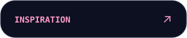

  

  
  
  

  <picture>
    <source media="(max-width: 600px)" srcset="./assets/torine-about-mobile.svg" />
    
  </picture>

  <picture>
    <source media="(max-width: 600px)" srcset="./assets/toolbox-mobile.svg" />
    
  </picture>

  

