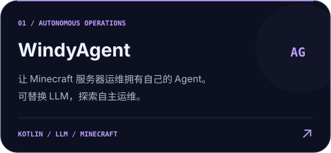
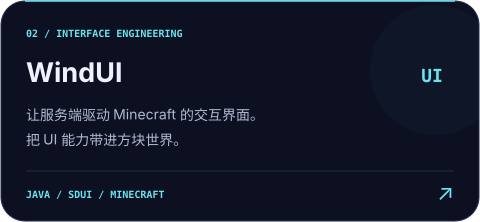
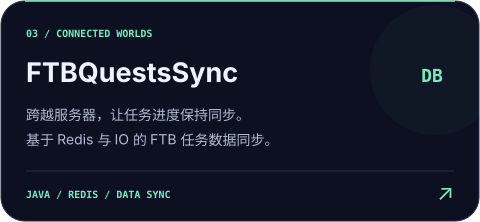
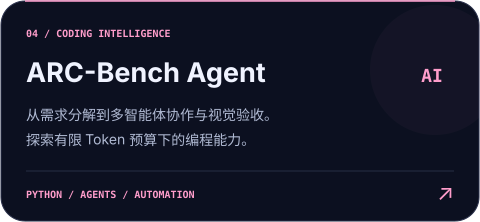
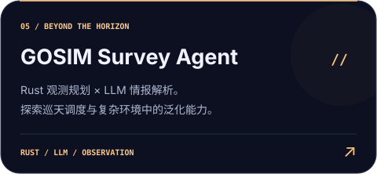
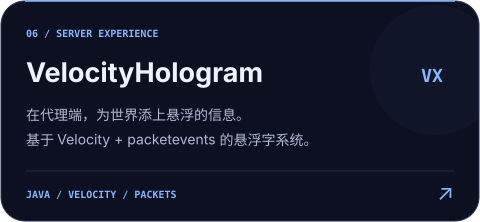

  

  
  &nbsp;
  
  &nbsp;
  

 

### 🪐 &nbsp; 关于我 · Behind the code

**热爱 Java，也热爱把想象变成可以运行的东西。**

从 Minecraft 插件、跨服数据同步，到 AI Agent 与自动化工具，我喜欢拆解复杂问题，也享受打磨细节。代码之外，用摄影、视频剪辑和 Photoshop 记录与创造。

| ⚡ 构建系统 | 🧠 探索智能 | 🎨 保持创造 |
| :--- | :--- | :--- |
| Java / JVM · 服务端开发 | LLM · Agent · 自动化 | 摄影 · 视频剪辑 · 视觉设计 |
| 关注架构、性能与数据流转 | 把新的想法放进真实项目里 | 让功能与美感一起成立 |

 

### 🌈 &nbsp; 技术星图 · My toolbox

 

### 🚀 &nbsp; 作品轨道 · Selected projects

从方块世界，到智能体的下一步。点击卡片，进入项目。

  
  

  
  

  
  

  <a href="https://github.com/windy664?tab=repositories"><b>探索全部仓库 →</b></a>

 

  

